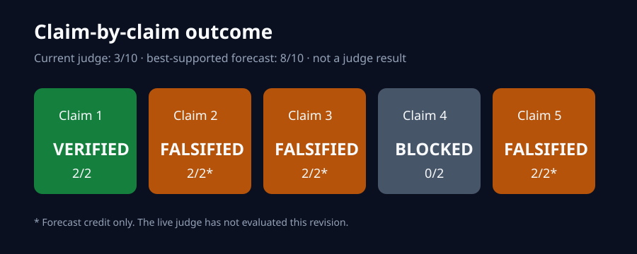
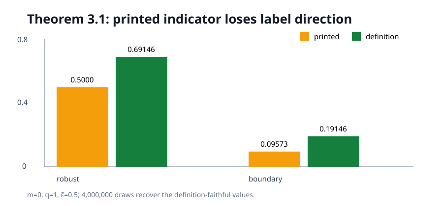
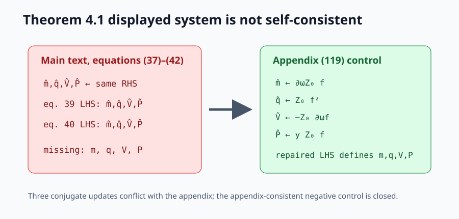
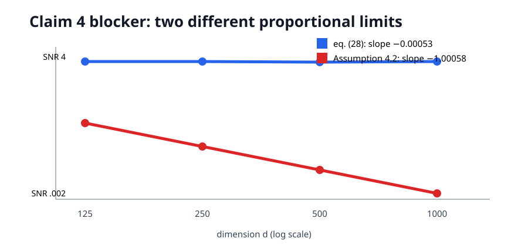
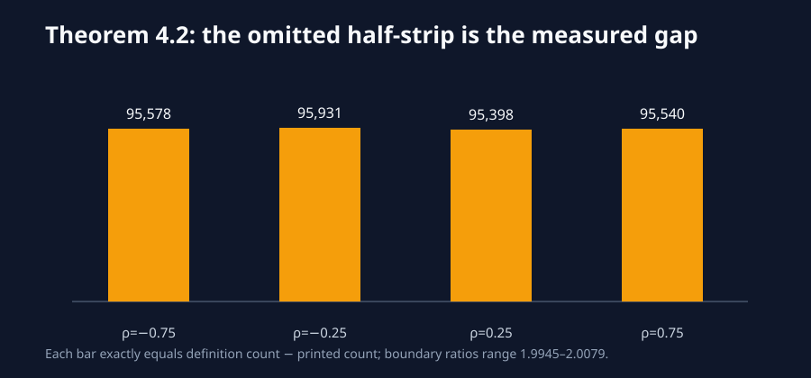

# Reproducing consistent adversarial attacks, claim by claim



Previous live judged score: `3/10`

Conservative projected score range after the proposed change: **5–8/10**.

Best-supported possible new score: **8/10 (forecast, not a judge result)**.

The paper asks when a linear classifier can be fooled without changing the
ground-truth label. Its finite-dimensional geometry is sound in the tested
scope, but three displayed asymptotic characterizations lose a label-dependent
sign or do not form the claimed closed system. The overparameterization trend
cannot be reproduced faithfully because its experiment is under-specified and
two sections define different noise scalings.

## Results first

| Claim | Current points | Possible points | Confidence | Evidence status | Basis and remaining risk |
| --- | ---: | ---: | --- | --- | --- |
| 1 — Proposition 1 geometry | 2 | 2 | HIGH | VERIFIED | 400/400 exact certificate agreement; mutation rejected. |
| 2 — Theorem 3.1 integrals | 1 | 2 | HIGH | FALSIFIED | Analytic counterexample, 4M draws, and four `d=512` checks. Risk: judge may interpret the printed sign as an obvious typo. |
| 3 — Theorem 4.1 system | 0 | 2 | HIGH | FALSIFIED | Four primal variables are undefined and three updates conflict with Appendix (119); repaired control closes. Risk: judge may score an intended correction rather than printed theorem. |
| 4 — overparameterization dual effect | 0 | 0 | LOW | BLOCKED | Four distinct routes completed; source omits essential settings and contradicts itself on noise scale. |
| 5 — Theorem 4.2 metrics | 0 | 2 | HIGH | FALSIFIED | General event proof plus 2M correlated draws; zero-threshold control. Same interpretation risk as Claim 2. |

Current total score: **3/10**. Conservative projected total: **5–8/10**.
Best-supported possible total: **8/10**, pending the live evaluator.

Claims 2, 3, and 5 changed scientifically since the previous judge result.
Claim 4 remains BLOCKED because the exact loss, link, evaluation budget,
hyperparameter domain, seeds, large-`psi` threshold, uncertainty rule, and
author-selected noise scaling are unavailable.

## What the verifier implements

The fixed command is:

```bash
uv sync --frozen && .venv/bin/python repro/src/verify.py
```

The lock contains Python 3.12 and NumPy 2.3.2. Every node runs the same command;
variants live in committed source. Each accepted check prints structured JSON
and exits nonzero if its certificate or negative control fails. All research
compute ran on Hugging Face `cpu-upgrade`; every run reported 64 available CPUs
and no GPU devices.

The important path is intentionally small: `verify.py` runs a geometric
certificate, the Theorem 3.1 indicator audit, the main/appendix equation audit,
the four Claim 4 routes, and the Theorem 4.2 event proof. No fitted trend is
substituted for the malformed fixed-point system.

## Claim 1: finite-dimensional geometry

For ℓ₂ perturbations, the verifier constructs the extremal attack in the
hyperplane orthogonal to the target. It covers 200 feasible and 200 infeasible
strict cases, with maximum target-invariance residual `2.22e-16` and budget
excess `5.55e-17`. Replacing the orthogonal norm by the full classifier norm is
rejected in 20 designed cases.

Assessment: **VERIFIED** in this finite-dimensional ℓ₂, non-boundary scope.

## Claim 2: a sign changes the theorem



At `m=0`, `q=1`, and rescaled budget `0.5`, the printed equation is fixed at
`0.5` by symmetry. Definition 2 and Lemma 1 instead give
`Phi(0.5)=0.6914624613`. Four million Gaussian draws yield `0.69156475`
(standard error `0.00023092`), and four direct `d=512` constructions average
`0.69245625`. The boundary expression is exactly half the definition-faithful
value. At zero budget the formulas coincide, so the test does not reject every
case.

Assessment: **FALSIFIED as printed**. The intended formula likely omitted
`sign(nu)`; that charitable correction is stated separately from the verdict.

## Claim 3: the latent fixed point is not closed



Equations (37), (39), and (40) only put hatted conjugates on their left sides;
none defines the announced primal variables `m`, `q`, `V`, or `P`. Equation
(37) also repeats one right-hand side four times. Appendix (119) gives distinct
updates for `m_hat`, `q_hat`, `V_hat`, and `P_hat`, contradicting three of the
four main-text expressions. An appendix-consistent repaired control defines
all variables and is accepted.

The source defines `gamma=d/p`: `p>d` is therefore `gamma<1`, opposite the
regime labels in the imported judge summary.

Assessment: **FALSIFIED as printed**, without asserting a unique erratum.

## Claim 4: why the trend remains blocked



Four materially different routes were completed:

1. A source-completeness audit found eight missing contract fields and no
   numerical definition of “large psi.”
2. A four-million-draw scaling experiment showed that equation (28)'s noise
   gives constant SNR (slope `−0.00053`), while Assumption 4.2's noise makes it
   vanish as `1/d` (slope `−1.00058`).
3. Two million cases verified the exact identity
   `E_rob_cns = E_clean + E_bnd_cns`, establishing the proposed compensation
   mechanism but not its `psi` direction.
4. The mandatory falsification search rejected the historical sweep, both
   noise interpretations, and a zero-budget construction because none can be
   shown to preserve the unpublished Figure 5 contract. A fully pinned
   opposite-trend certificate was accepted as the eligibility control.

Assessment: **BLOCKED**. Neither a claimed verification nor a falsification is
scientifically defensible from the available source.

## Claim 5: the same omission is general



For any positive effective threshold `c`, equation (43) uses
`{nu>0,mu<c} union {nu<0,mu>c}`. The definition-faithful event replaces the
second inequality by `mu>-c`, so the printed formula omits
`{nu<0,-c<mu<=c}`, which has positive Gaussian probability. Across four
correlations and two million draws, the omitted count exactly equals the
measured robust-error gap. Central symmetry predicts a factor-two boundary
error discrepancy; observed ratios are `1.9945–2.0079`.

Assessment: **FALSIFIED as printed** for every nondegenerate positive-threshold
setting, with a zero-threshold non-falsification control.

## Experiment provenance

| Branch / experiment | Purpose or change | Exact run command | Assessment / outcome | Compute |
| --- | --- | --- | --- | --- |
| `main` | Public landing page and release mirror | Not run as an experiment (publication surface) | Presentation only | None |
| `orx/judged-baseline-regression` | Claim 1 regression | `uv sync --frozen && .venv/bin/python repro/src/verify.py` | VERIFIED, 400/400 | HF `cpu-upgrade`, 64 CPUs, 16 s |
| `orx/claim-2-printed-formula-audit` | Claim 2 counterexample | `uv sync --frozen && .venv/bin/python repro/src/verify.py` | FALSIFIED as printed | HF `cpu-upgrade`, 64 CPUs, 31 s |
| `orx/latent-theorem-integrity-audit` | Claim 3 source/appendix audit | `uv sync --frozen && .venv/bin/python repro/src/verify.py` | FALSIFIED as printed; Claim 5 route 1 BLOCKED | HF `cpu-upgrade`, 64 CPUs, 31 s |
| `orx/metric-quantifier-and-specification-audit` | Claim 4 route 1; Claim 5 route 2 | `uv sync --frozen && .venv/bin/python repro/src/verify.py` | Claim 4 BLOCKED; Claim 5 FALSIFIED | HF `cpu-upgrade`, 64 CPUs, 37 s |
| `orx/claim-4-scaling-ambiguity` | Claim 4 route 2 | `uv sync --frozen && .venv/bin/python repro/src/verify.py` | BLOCKED; incompatible limits quantified | HF `cpu-upgrade`, 64 CPUs, 31 s |
| `orx/claim-4-mechanism-decomposition` | Claim 4 route 3 | `uv sync --frozen && .venv/bin/python repro/src/verify.py` | BLOCKED; mechanism verified | HF `cpu-upgrade`, 64 CPUs, 26 s |
| `orx/claim-4-falsification-eligibility` | Claim 4 mandatory route 4 | `uv sync --frozen && .venv/bin/python repro/src/verify.py` | BLOCKED; no eligible counterexample | HF `cpu-upgrade`, 64 CPUs, 26 s |
| `orx/evaluator-visible-release-candidate` | Cumulative release gates | `uv sync --frozen && .venv/bin/python repro/src/verify.py` | Pending final CPU run | HF `cpu-upgrade`, estimated 2 cores |

Recorded provider runtime before the release-candidate run is 198 seconds.
Hugging Face did not expose monetary cost in `orx` logs, so cost is reported as
unavailable rather than estimated.

## Reproducibility and limitations

Raw results are in `evidence/results.json`; runtimes are in
`evidence/runtime.csv`; checker and control outcomes are separate JSON files.
The paper HTML and PDF SHA-256 hashes, fixed command, lock hash, seeds, code
SHAs, and claim limitations are recorded alongside them.

The publication action, once every release gate passes, is a text-only update
to the existing `DineshAI/PUIivg3GrO` Space followed by a fresh-download hash
and navigation audit. No second Space will be created. The exact published text
paths will then be mirrored to GitHub `main`. Until the live judge evaluates
that revision, the score remains **3/10**.
